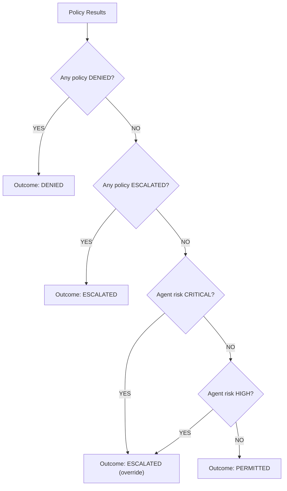

# Action Gate

The Action Gate is Layer 3 of the pipeline. It combines policy evaluation results with agent risk assessment to produce the final decision outcome.

## Decision Hierarchy

The gate enforces a strict outcome hierarchy:

```
DENIED > ESCALATED > PERMITTED
```

This means:
- A DENY from any policy cannot be overridden
- An ESCALATE can only be overridden by a DENY
- PERMITTED is the default only when nothing else triggers

## Gate Logic



## Risk Level Overrides

Even when all policies pass, the agent's risk level can trigger escalation:

| Risk Level | Behavior |
|-----------|----------|
| LOW | No override — policies determine outcome |
| MEDIUM | No override — policies determine outcome |
| HIGH | PERMITTED → ESCALATED |
| CRITICAL | All outcomes → ESCALATED (except DENIED) |

This ensures that high-risk agents always have human oversight, regardless of policy rules.

## Fail-Closed Default

If the gate encounters any unexpected condition:
- Missing policy results → DENIED
- Unknown risk level → DENIED
- Exception during evaluation → DENIED

The gate never produces PERMITTED under uncertainty.
