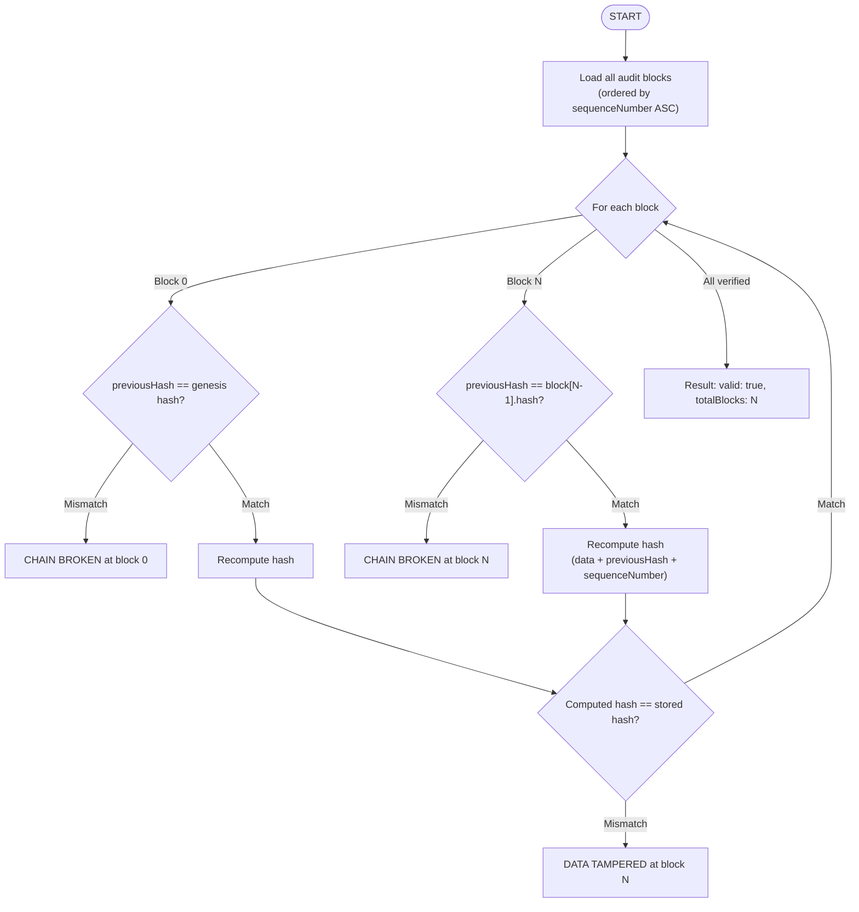

# Audit Verification

The audit verification process ensures the integrity of the decision audit trail.

## Verification Process



## When to Verify

| Trigger | Frequency |
|---------|-----------|
| API endpoint (`GET /v1/audit/integrity`) | On-demand |
| Dashboard button | On-demand |
| SOC 2 evidence collection | Quarterly |
| Compliance report generation | Monthly |
| After database restoration | Immediately |
| Suspected tampering | Immediately |

## Tamper Scenarios and Detection

| Scenario | Detection |
|----------|-----------|
| Record data modified | Hash mismatch on that block |
| Record deleted | Sequence number gap |
| Record inserted | Chain break at insertion point |
| Record reordered | previousHash mismatch |
| Genesis hash changed | First block fails verification |

## SOC 2 Evidence

The verification result is included in SOC 2 evidence reports:

```json
{
  "data_protection": {
    "audit_chain_valid": true,
    "total_audit_blocks": 47832,
    "chain_verified_at": "2026-03-01T12:00:00Z"
  }
}
```

## Compliance Reporting Process

1. **Schedule**: Monthly or quarterly evidence collection
2. **Generate**: Call `GET /v1/compliance/soc2-evidence?period=2026-Q1`
3. **Review**: Compliance officer reviews the report
4. **Archive**: Report stored for regulatory audits
5. **Action**: Any chain integrity failures trigger investigation

## Decision Replay

Complement verification with decision replay:

```bash
POST /v1/decisions/:id/replay
```

This re-evaluates a historical decision against current policies, showing:
- Would the outcome have changed?
- Which policies would now trigger?
- Impact assessment for policy changes
