# Decision Flow

This document describes the complete business process from action proposal to governed outcome.

## Process Overview

```mermaid
flowchart TD
    A["1. AI Agent generates recommendation\n(e.g., approve loan for $250K)"]
    B["2. Application calls aegl.decide()\nPasses: actionType, actionPayload, context"]
    C["3. E-AEGL API receives DecisionRequest\n- Validates request (Zod schema)\n- Authenticates API key (SHA-256 lookup)\n- Verifies agent is active\n- Starts precision timer"]
    D["4. Policy Engine evaluates all active policies\n- Sorted by priority (lower = higher priority)\n- Each rule evaluated against action payload\n- Results: PASS, FAIL, or ESCALATE per policy"]
    E["5. Action Gate determines final outcome\n- DENY > ESCALATE > PERMIT hierarchy\n- Agent risk level may override to ESCALATE"]
    F["6. Atomic write (single Prisma transaction)\n- Decision record\n- PolicyEvaluation records\n- Escalation record (if ESCALATED)\n- AuditLog entry (hash-chained)"]
    G["7. Response returned to SDK\n- outcome, evaluations, latencyMs\n- escalationId + slaDeadline (if escalated)"]
    H["8. Application acts on outcome\n- PERMITTED: execute the action\n- DENIED: block the action, log reason\n- ESCALATED: queue for human review"]
    I["9. Webhooks dispatched (non-blocking)\n- decision.permitted / denied / escalated\n- Slack, PagerDuty, email, custom integrations"]

    A --> B --> C --> D --> E --> F --> G --> H --> I
```

## Error Handling

At every step, failures result in fail-closed behavior:

| Failure Point | Behavior |
|--------------|----------|
| API unreachable | SDK returns DENIED (fail-closed) or uses local cache |
| Invalid API key | 401 error thrown (not caught by fail-closed) |
| Agent not found | Decision rejected with error |
| Policy evaluation error | DENIED (fail-closed) |
| Database write fails | Transaction rolls back, DENIED |
| Webhook dispatch fails | Non-blocking, retried 3 times |

## Latency Budget

| Step | Target | Typical |
|------|--------|---------|
| Request validation | < 0.5ms | 0.1ms |
| API key auth | < 1ms | 0.5ms |
| Policy fetch | < 1ms | 0.3ms |
| Policy evaluation | < 5ms | 1-3ms |
| Action gate | < 0.5ms | 0.1ms |
| Database write | < 3ms | 1-2ms |
| **Total** | **< 10ms** | **3-5ms** |
