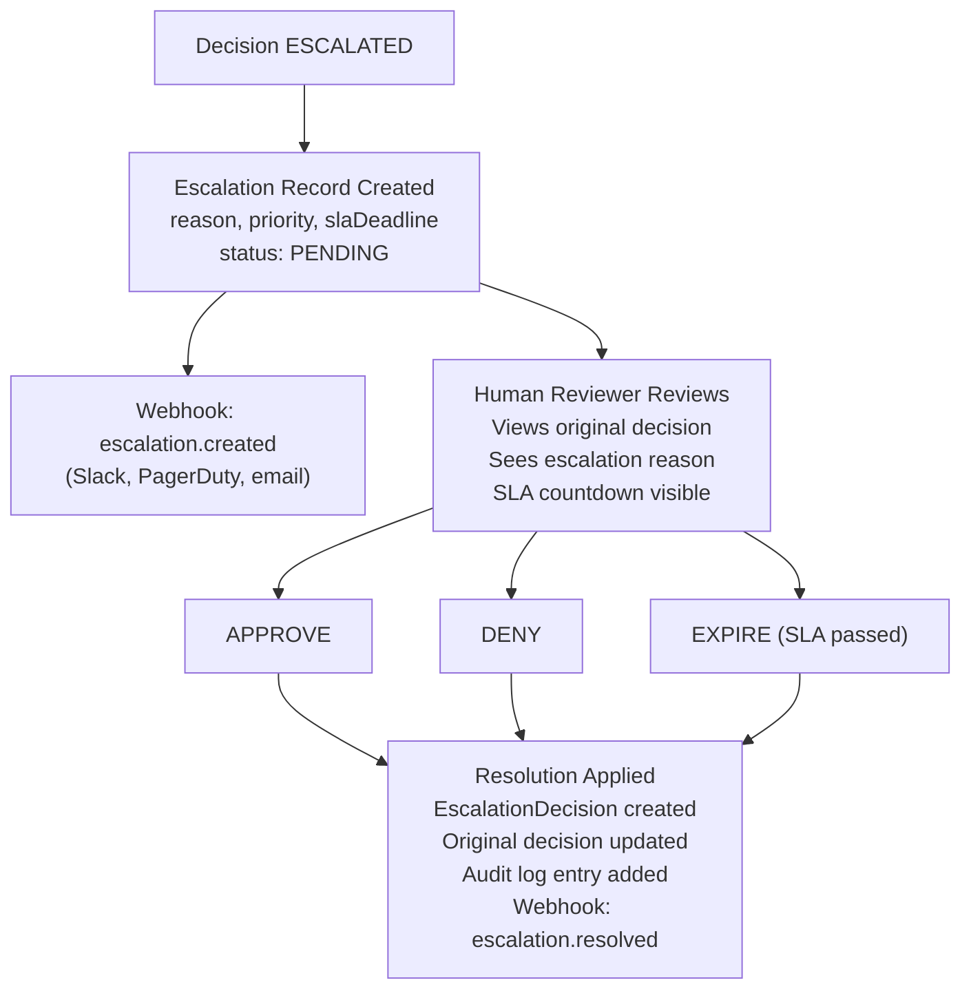

# Escalation Flow

When a decision requires human review, the escalation flow manages the handoff from automated governance to human judgment.

## Trigger Conditions

An escalation is created when:

1. A **THRESHOLD policy** fires — the policy explicitly triggers escalation instead of denial
2. An **ESCALATE rule action** matches — individual rules can specify `action: ESCALATE`
3. A **HIGH/CRITICAL risk agent** submits a decision that would otherwise be PERMITTED

## Process Flow

## SLA Deadlines

SLA deadlines are calculated based on escalation priority:

| Priority | Default SLA |
|----------|-------------|
| CRITICAL | 1 hour |
| HIGH | 4 hours |
| MEDIUM | 24 hours |
| LOW | 72 hours |

The SLA worker monitors deadlines and marks expired escalations.

## Reviewer Decision

When a reviewer submits a decision:

1. **Validation**: Only PENDING escalations can be resolved
2. **EscalationDecision record**: Records the reviewer ID, decision, and rationale
3. **Decision update**: The original Decision record's outcome is changed from ESCALATED to PERMITTED or DENIED
4. **Audit log**: A new hash-chained audit entry records the review
5. **Webhook**: `escalation.resolved` event dispatched

## Multiple Reviewers

Multiple reviewers can submit decisions on the same escalation. The first approved decision takes effect. This supports:
- Review committees with majority voting
- Backup reviewers when primary is unavailable
- Audit trail of all reviewer opinions
