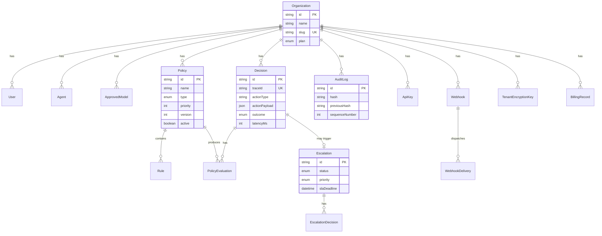

# Data Model

E-AEGL uses PostgreSQL with Prisma ORM. The schema contains 16 models organized around organizations, policies, decisions, and audit trails.

## Entity Relationship Diagram



## Core Models

### Organization

```prisma
model Organization {
  id        String   @id @default(cuid())
  name      String
  slug      String   @unique
  plan      Plan     @default(TRIAL)
  settings  Json     @default("{}")
  createdAt DateTime @default(now())
  updatedAt DateTime @updatedAt
}

enum Plan {
  TRIAL
  STARTER
  ENTERPRISE
  SELF_HOSTED
}
```

### Policy

```prisma
model Policy {
  id             String   @id @default(cuid())
  organizationId String
  name           String
  description    String?
  type           PolicyType
  priority       Int      @default(100)
  version        Int      @default(1)
  active         Boolean  @default(true)
  scope          Json?    // { action_types: [], agent_ids: [] }
  createdAt      DateTime @default(now())
  updatedAt      DateTime @updatedAt

  rules          Rule[]
  evaluations    PolicyEvaluation[]
}

enum PolicyType {
  STATIC
  DYNAMIC
  THRESHOLD
}
```

### Decision

```prisma
model Decision {
  id             String   @id @default(cuid())
  organizationId String
  traceId        String   @unique
  agentId        String?
  modelId        String?
  userId         String?
  actionType     String
  actionPayload  Json
  context        Json     @default("{}")
  outcome        DecisionOutcome
  outcomeReason  String?
  latencyMs      Int      @default(0)
  receivedAt     DateTime @default(now())

  evaluations    PolicyEvaluation[]
  escalation     Escalation?
}

enum DecisionOutcome {
  PERMITTED
  DENIED
  ESCALATED
  TIMEOUT_DENIED
}
```

### AuditLog

```prisma
model AuditLog {
  id             String   @id @default(cuid())
  organizationId String
  traceId        String
  actionType     String
  outcome        String
  data           Json
  previousHash   String
  hash           String
  sequenceNumber Int
  createdAt      DateTime @default(now())

  @@unique([organizationId, sequenceNumber])
  @@index([organizationId, createdAt])
}
```

### Escalation

```prisma
model Escalation {
  id             String           @id @default(cuid())
  organizationId String
  decisionId     String           @unique
  reason         String
  status         EscalationStatus @default(PENDING)
  priority       Priority         @default(MEDIUM)
  slaDeadline    DateTime
  resolvedBy     String?
  resolvedAt     DateTime?
  createdAt      DateTime         @default(now())

  decisions      EscalationDecision[]
}

enum EscalationStatus {
  PENDING
  APPROVED
  DENIED
  EXPIRED
}
```

## Key Indexes

| Model | Index | Purpose |
|-------|-------|---------|
| AuditLog | `[organizationId, sequenceNumber]` | Hash chain ordering |
| AuditLog | `[organizationId, createdAt]` | Time-range queries |
| Decision | `[organizationId, receivedAt]` | Time-range filtering |
| Decision | `[traceId]` | Unique trace lookup |
| Policy | `[organizationId, active]` | Active policy fetch |
| ApiKey | `[keyHash]` | Fast key lookup |

## Cascading Relationships

- Deleting an Organization cascades to all child records
- Deactivating a Policy preserves it for audit trail (soft delete)
- Decisions are immutable once created (append-only)
