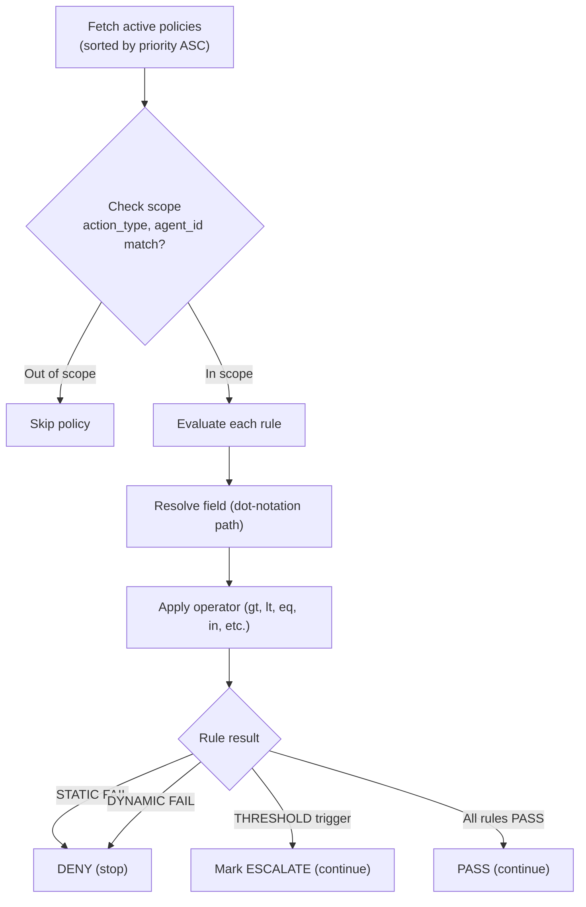
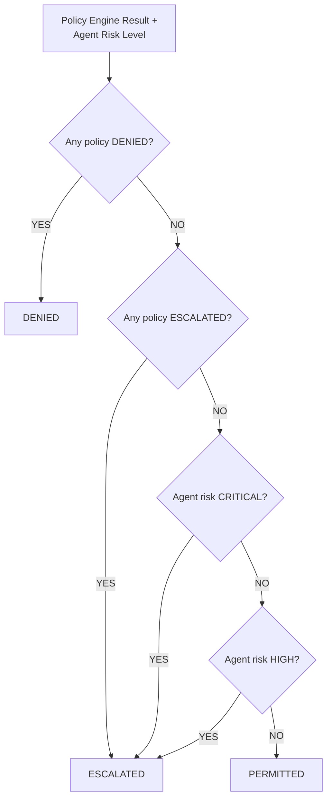
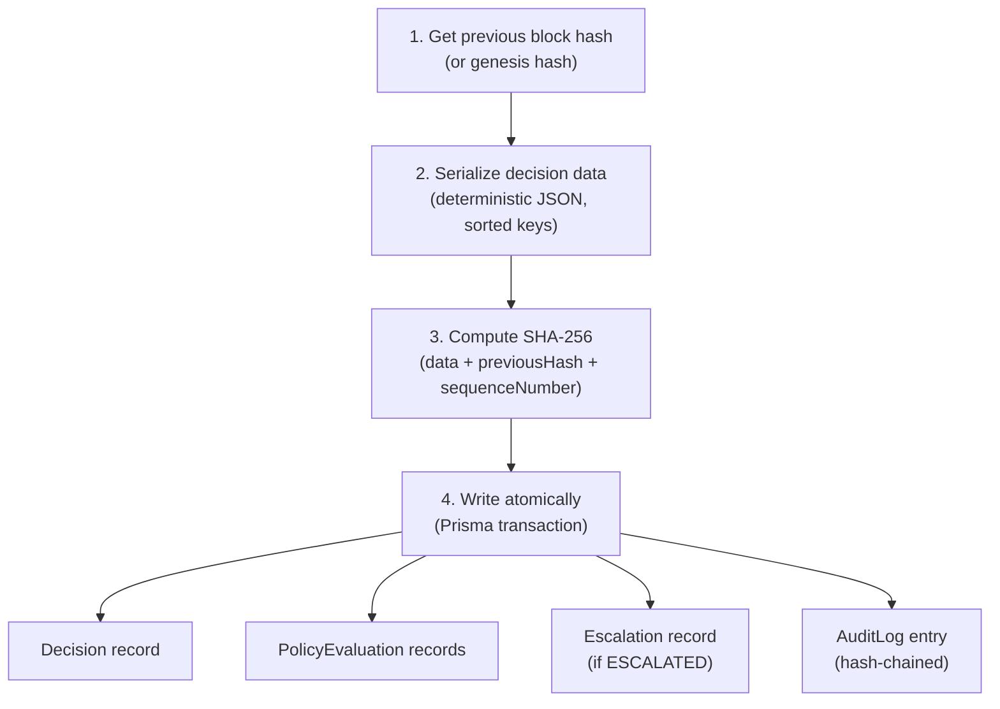

# Four-Layer Pipeline

Every decision request passes through four layers in sequence. The entire pipeline completes in under 10ms.

## Layer 1: Decision Boundary Interceptor

**Latency budget**: < 2ms

The interceptor captures the action proposal with full context:

```json
{
  "action_type": "approve_loan",
  "action_payload": { "amount": 250000, "credit_score": 720 },
  "context": { "department": "mortgage" },
  "agent_id": "agent_abc123",
  "user_id": "analyst-42",
  "model_id": "model_gpt4o"
}
```

This layer:
1. Validates the request body with Zod schema
2. Starts a high-precision timer (`process.hrtime.bigint()`)
3. Looks up the agent and verifies it is active
4. Passes the validated request to Layer 2

## Layer 2: Policy Engine

**Latency budget**: < 5ms

The policy engine evaluates all active policies in priority order:



Key properties:
- **Deterministic**: Same input always produces same output
- **No ML classifiers**: Rules evaluate in microseconds
- **Fail-closed**: If evaluation throws, return DENY
- **Priority ordering**: Lower priority number evaluates first

## Layer 3: Action Gate

**Latency budget**: < 1ms

The action gate combines policy results with agent risk assessment:



The gate enforces a strict hierarchy: DENIED > ESCALATED > PERMITTED.

## Layer 4: Audit Logger

**Latency budget**: < 2ms

Every decision is recorded in the append-only, hash-chained audit log:



The transaction uses **serializable isolation** to prevent race conditions under concurrent writes.

## Atomicity

All four layers complete in a single Prisma `$transaction`. If any layer fails, the entire operation rolls back. No partial writes. No orphaned records.

```typescript
await db.$transaction(async (tx) => {
  // Create Decision
  // Create PolicyEvaluation records
  // Create Escalation (if needed)
  // Create AuditLog entry (hash-chained)
}, {
  isolationLevel: Prisma.TransactionIsolationLevel.Serializable,
});
```

## Latency Measurements

Measured with `process.hrtime.bigint()` for sub-millisecond precision:

| Metric | Target | Typical |
|--------|--------|---------|
| Full pipeline | < 10ms | 3–5ms |
| Policy evaluation | < 5ms | 1–3ms |
| Database write | < 3ms | 1–2ms |
| Network overhead | < 2ms | < 1ms |

Benchmark results (1000 decisions, 5 policies):
- **p50**: 3ms
- **p95**: 7ms
- **p99**: 11ms
