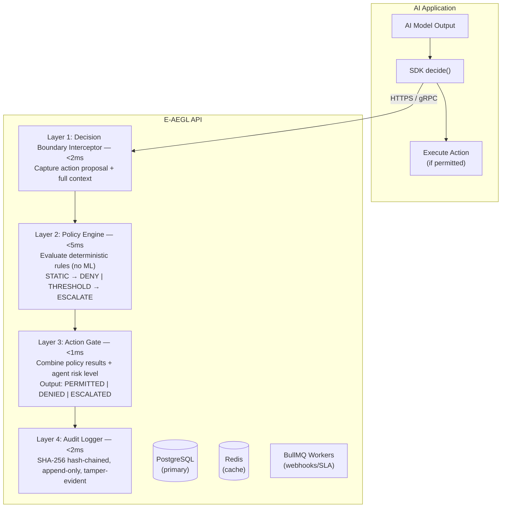

# System Overview

E-AEGL is **AI Decision Control Infrastructure** — an enterprise governance layer that enforces policy, logs cognition, and controls downstream actions at the moment where AI output becomes real-world action.

## Architecture Diagram



## Design Principles

1. **No ML in the critical path** — The policy engine evaluates deterministic rules only. No classifiers, no probabilistic decisions during enforcement.

2. **SDK-first, not proxy** — We instrument the application, not the network. No TLS termination, no man-in-the-middle interception.

3. **Decision boundary only** — We govern the moment where AI output becomes action. Not token-level inspection.

4. **Append-only audit with hash chains** — Every record includes SHA-256 hash of its contents plus previous hash. Tamper-evident and legally defensible.

5. **Fail-closed by default** — If any component errors, the action is DENIED.

6. **Immutable policy versions** — Updating a policy creates a new version. Old versions preserved for audit trail integrity.

7. **Multi-tenancy with provable isolation** — Row-level security, per-tenant encryption keys, data residency enforcement.

## Tech Stack

| Component | Technology |
|-----------|-----------|
| **Monorepo** | Turborepo |
| **API** | Node.js + Express + TypeScript |
| **Database** | PostgreSQL 15 + Prisma ORM |
| **Cache/Queue** | Redis 7 + BullMQ |
| **Dashboard** | Next.js 14 + NextAuth |
| **SDKs** | TypeScript + Python |
| **CLI** | Commander.js |
| **Observability** | OpenTelemetry + Prometheus |
| **Deployment** | Docker Compose + Terraform |

## Monorepo Structure

```
aegl/
├── apps/
│   ├── api/              # Express API server
│   ├── dashboard/        # Next.js dashboard
│   ├── docs-site/        # Docusaurus documentation
│   └── web/              # Marketing website
├── packages/
│   ├── sdk/              # TypeScript SDK (@aegl/sdk)
│   ├── sdk-python/       # Python SDK (aegl)
│   └── cli/              # CLI tool (@aegl/cli)
├── docker/               # Docker Compose configs
├── scripts/              # Automation scripts
├── e2e/                  # E2E test suites
└── docs/                 # Internal docs (DR runbook, etc.)
```

## Data Model

The system uses 16 Prisma models:

| Model | Description |
|-------|-------------|
| `Organization` | Top-level tenant |
| `User` | Team members |
| `Agent` | AI agents that submit decisions |
| `ApprovedModel` | Approved AI models |
| `Policy` | Governance policies |
| `Rule` | Individual policy rules |
| `Decision` | Decision records |
| `PolicyEvaluation` | Per-policy evaluation results |
| `Escalation` | Human review requests |
| `EscalationDecision` | Reviewer decisions |
| `AuditLog` | Hash-chained audit entries |
| `ApiKey` | API key credentials |
| `Webhook` | Webhook subscriptions |
| `WebhookDelivery` | Webhook delivery records |
| `TenantEncryptionKey` | Per-tenant encryption |
| `BillingRecord` | Usage billing records |
