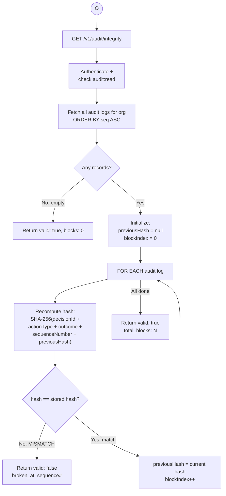
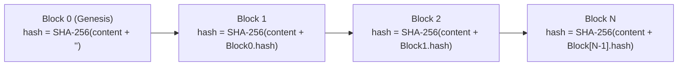
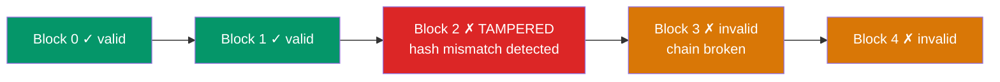

# BP-004: Audit Verification

**Process ID:** BP-004
**Type:** On-demand verification
**SLA:** &lt; 30 seconds for full chain
**Trigger:** API call `GET /v1/audit/integrity` or CLI `aegl audit integrity`
**Owner:** Audit subsystem
**Source:** `apps/api/src/audit/logger.ts` (verifyChainIntegrity)

## BPMN Diagram



## Hash Chain Structure

Each audit log entry contains:

```
AuditLog[n] = {
    id:             unique identifier
    decisionId:     FK to Decision
    sequenceNumber: monotonically increasing integer
    hash:           SHA-256(content + previousHash)
    previousHash:   AuditLog[n-1].hash  (null for genesis block)
    fullRecord:     JSON snapshot of the decision + evaluations
    createdAt:      timestamp
}
```

### Chain Linking



### Tamper Detection

If ANY record is modified after creation:
1. Its hash no longer matches `SHA-256(content + previousHash)`
2. Every subsequent record's hash is also invalid (chain broken)
3. The `broken_at` sequence number identifies the first tampered record



## Verification Response

```json
{
  "valid": true,
  "total_blocks": 15847,
  "broken_at": null,
  "verified_at": "2026-03-01T12:00:00.000Z"
}
```

Or if tampered:

```json
{
  "valid": false,
  "total_blocks": 15847,
  "broken_at": "4523",
  "verified_at": "2026-03-01T12:00:00.000Z"
}
```

## Export Formats

### CSV Export (`GET /v1/audit/export`)

| Column | Description |
|--------|-------------|
| sequence_number | Monotonic sequence |
| trace_id | Decision trace ID |
| action_type | What action was governed |
| outcome | PERMITTED / DENIED / ESCALATED / TIMEOUT_DENIED |
| outcome_reason | Human-readable reason |
| latency_ms | Processing time |
| agent_id | AI agent identifier |
| model_id | AI model identifier |
| user_id | End user |
| hash | SHA-256 hash of this record |
| previous_hash | Hash of previous record (chain link) |
| received_at | Decision timestamp |
| audit_created_at | Audit log creation timestamp |

### Legal Defensibility

The hash chain provides:
1. **Integrity**: Any modification breaks the chain and is detectable
2. **Ordering**: Sequence numbers prove chronological order
3. **Completeness**: Missing records create hash mismatches
4. **Non-repudiation**: Each record links to its predecessor cryptographically
5. **Verifiability**: Any party can independently verify the chain with the hash algorithm
