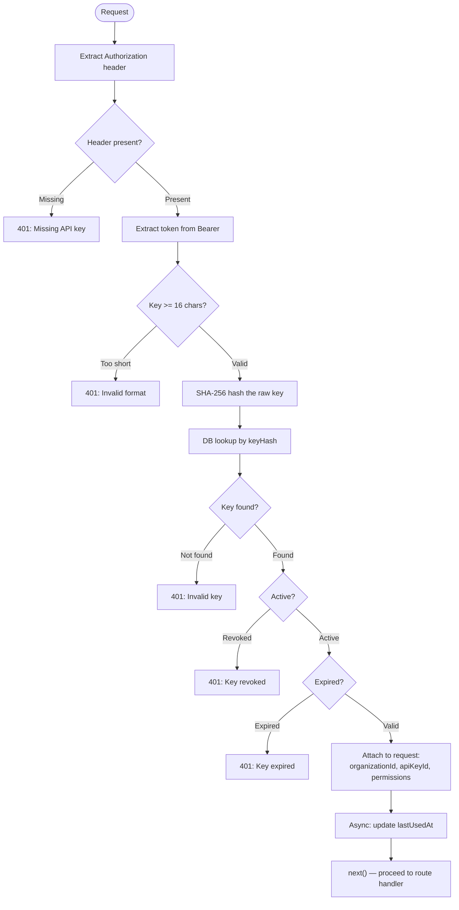
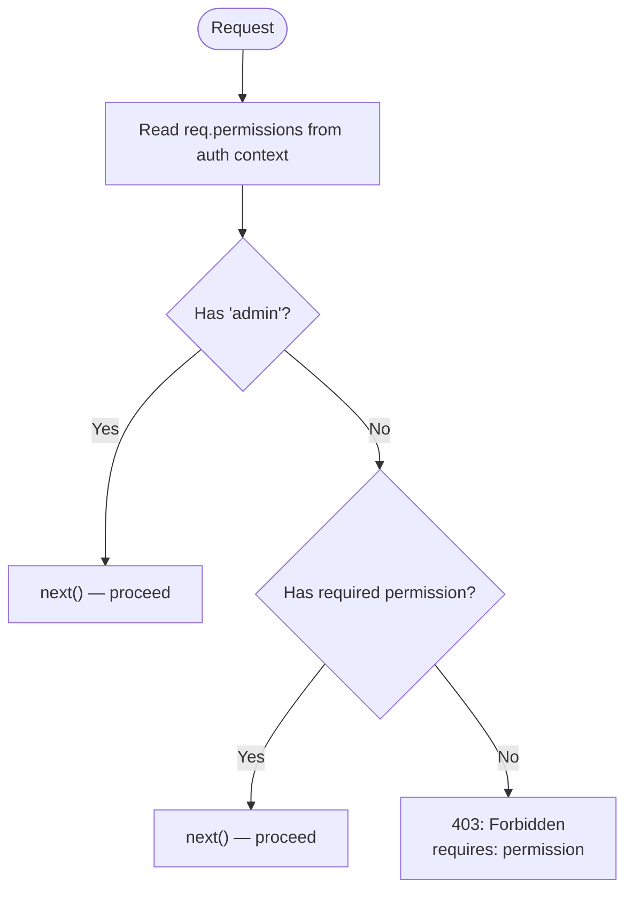
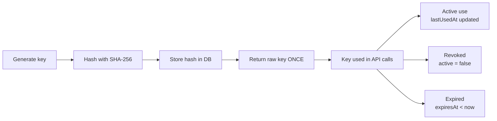

# BP-005: Authentication & Authorization

**Process ID:** BP-005
**Type:** Per-request middleware
**SLA:** &lt; 2ms combined
**Trigger:** Every API request
**Owner:** Auth middleware
**Source:** `apps/api/src/auth/api-key.ts`, `apps/api/src/auth/rbac.ts`

## BPMN Diagram — Authentication

## BPMN Diagram — RBAC Authorization

## RBAC Permission Matrix

| Role | Permissions Granted |
|------|-------------------|
| **OWNER** | `admin` (grants all) |
| **ADMIN** | `decisions:read`, `decisions:write`, `policies:read`, `policies:write`, `escalations:read`, `escalations:write`, `agents:read`, `agents:write`, `models:read`, `models:write`, `webhooks:read`, `webhooks:write`, `audit:read`, `audit:export`, `org:read`, `org:write` |
| **POLICY_MANAGER** | `decisions:read`, `policies:read`, `policies:write`, `escalations:read`, `agents:read`, `models:read`, `webhooks:read`, `webhooks:write`, `audit:read`, `audit:export` |
| **REVIEWER** | `decisions:read`, `escalations:read`, `escalations:write`, `agents:read`, `models:read`, `audit:read` |
| **VIEWER** | `decisions:read`, `escalations:read`, `agents:read`, `models:read`, `audit:read` |

## API Key Lifecycle

**Security properties:**
- Raw API key is returned **once** at creation — never stored or retrievable
- Only the SHA-256 hash is stored in the database
- Key comparison is hash-to-hash (constant-time safe)
- `lastUsedAt` tracks usage for audit purposes (async, non-blocking)
- Revocation is immediate — `active=false` checked on every request
