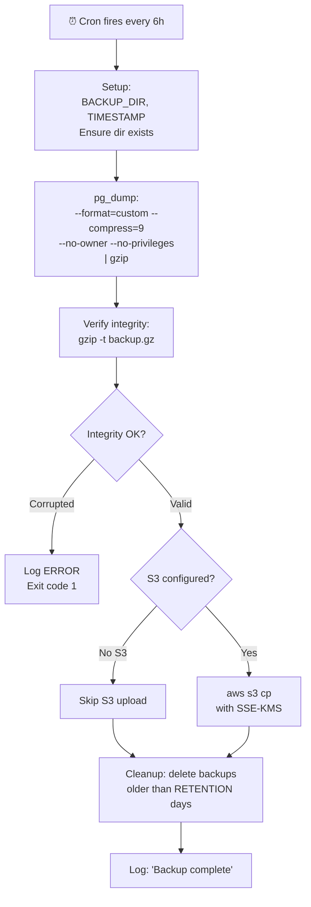
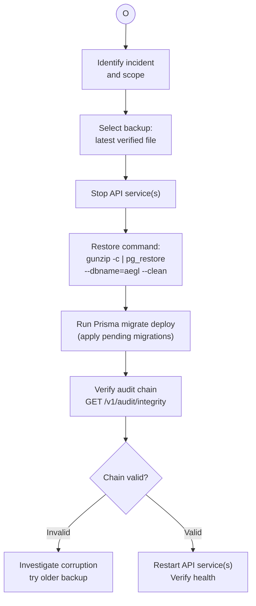

# BP-012: Backup & Restore

**Process ID:** BP-012
**Type:** Scheduled automation + manual restore
**Frequency:** Every 6 hours (configurable)
**RPO:** &lt; 6 hours
**RTO:** &lt; 15 minutes
**Owner:** Platform operations
**Source:** `scripts/backup-postgres.sh`, `docs/disaster-recovery-runbook.md`

## BPMN Diagram — Backup

## BPMN Diagram — Restore

## Backup Schedule

| Type | Frequency | Retention (Local) | Retention (S3) | Encryption |
|------|-----------|-------------------|----------------|------------|
| pg_dump (full) | Every 6 hours | 7 days | 30 days | AES-256 (S3 SSE-KMS) |
| WAL archive | Continuous | 7 days | 7 days | AES-256 |
| Redis AOF | Continuous | Local volume | — | — |
| Config/Secrets | On change | Indefinite | — | Secrets Manager |

## RPO/RTO Targets

| Component | RPO | RTO | Strategy |
|-----------|-----|-----|----------|
| **Audit Logs** | 0 (zero loss) | &lt; 15 min | WAL archiving + streaming replication |
| **Policy Store** | &lt; 1 min | &lt; 5 min | Streaming replication + auto-failover |
| **Decision Engine** | N/A | &lt; 2 min | Stateless, container restart |
| **Dashboard** | N/A | &lt; 5 min | Stateless, container restart |
| **Redis** | &lt; 5 min | &lt; 5 min | AOF + Sentinel failover |

## Configuration

| Parameter | Default | Env Var |
|-----------|---------|---------|
| Backup directory | /var/backups/aegl | `BACKUP_DIR` |
| Retention days | 7 | `BACKUP_RETENTION` |
| S3 bucket | — | `S3_BUCKET` |
| S3 prefix | — | `S3_PREFIX` |
| KMS key | — | `AWS_KMS_KEY_ID` |
| Compression | 9 (max) | — |
