# BP-011: Billing & Metering

**Process ID:** BP-011
**Type:** Continuous metering with monthly billing cycle
**Trigger:** Every decision increments usage counter
**Owner:** Billing subsystem
**Source:** `apps/api/src/billing/stripe-client.ts`, `apps/api/src/telemetry/metering.ts`

## BPMN Diagram

```mermaid
flowchart TD
    subgraph METERING["Pool: Usage Metering (per decision)"]
        M1(["O"]) --> M2["Decision processed\nsuccessfully"]
        M2 --> M3["Increment in-memory\ncounter for org"]
        M3 --> M4{"Flush threshold?"}
        M4 -->|"Not yet"| M_END(["END"])
        M4 -->|"Threshold reached"| M5["Flush to DB:\nUpdate usage record\nfor billing period"]
        M5 --> M_END2(["END"])
    end

    subgraph BILLING["Pool: Billing Cycle (monthly)"]
        B1["⏰ 1st of month"] --> B2["Calculate usage\nfor completed period"]
        B2 --> B3{"Plan type?"}
        B3 -->|"Self-Hosted"| B_SKIP["Skip billing\n(license-based)"]
        B3 -->|"Cloud"| B4["Lookup Stripe subscription"]
        B4 --> B5{"Over limit?"}
        B5 -->|"Within plan"| B_OK["No overage charge"]
        B5 -->|"Over limit"| B6["Calculate overage:\nusage - plan limit"]
        B6 --> B7["Report to Stripe:\noverage × $0.001/decision"]
        B7 --> B8["Stripe auto-charges\non next cycle"]
    end
```



## Plan Limits

| Plan | Monthly Decisions | Overage Price | Target Customer |
|------|------------------|---------------|-----------------|
| **TRIAL** | 1,000 | — | Evaluation |
| **STARTER** | 100,000 | $0.001/decision | Small teams |
| **ENTERPRISE** | 10,000,000 | $0.001/decision | Large organizations |
| **SELF_HOSTED** | Unlimited | License fee | Banks, defense |

## Billing Estimate Response

`GET /v1/org/usage`:

```json
{
  "period_start": "2026-03-01T00:00:00Z",
  "period_end": "2026-03-31T23:59:59Z",
  "decisions_total": 142857,
  "decisions_permitted": 128571,
  "decisions_denied": 10000,
  "decisions_escalated": 4286,
  "escalations_created": 4286,
  "escalations_resolved": 4100,
  "avg_latency_ms": 5,
  "billing_estimate": {
    "plan": "STARTER",
    "plan_limit": 100000,
    "current_usage": 142857,
    "overage_decisions": 42857,
    "overage_cost_usd": 42.86
  }
}
```

## Usage History

`GET /v1/org/usage/history?months=6` returns monthly breakdowns for trend analysis and capacity planning.
