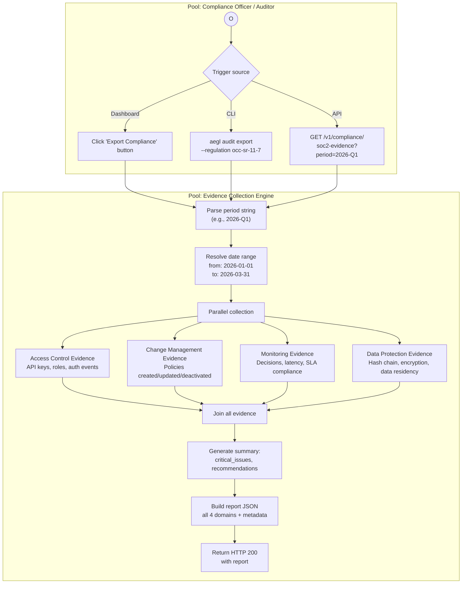

# BP-010: Compliance Reporting

**Process ID:** BP-010
**Type:** On-demand report generation
**SLA:** &lt; 60 seconds
**Trigger:** API call, CLI command, or dashboard action
**Owner:** Compliance subsystem
**Source:** `apps/api/src/compliance/evidence-collector.ts`, `apps/api/src/routes/compliance.ts`

## BPMN Diagram



## SOC 2 Trust Service Criteria Mapping

| TSC | Criteria | E-AEGL Evidence |
|-----|----------|----------------|
| **CC6.1** | Logical access security | API key management, RBAC roles, auth events |
| **CC6.2** | Access provisioning | User roles, key creation/revocation counts |
| **CC6.3** | Access removal | Key revocation, expiration tracking |
| **CC7.1** | Configuration management | Policy versioning, change tracking |
| **CC7.2** | Change management | Policy create/update/deactivate history |
| **CC7.3** | Testing of changes | Policy evaluation results, test coverage |
| **CC8.1** | Monitoring | Decision latency, throughput, SLA compliance |
| **A1.2** | Recovery objectives | RPO/RTO targets, backup verification |
| **PI1.1** | Data integrity | Hash chain verification, tamper detection |
| **P1.1** | Data protection | Encryption at rest, data residency |

## Compliance Summary Endpoint

`GET /v1/compliance/summary` provides a real-time compliance posture:

```json
{
  "period": "last_30_days",
  "posture": {
    "audit_chain_valid": true,
    "audit_chain_blocks": 15847,
    "active_policies": 12,
    "governance_rate": "34.2%"
  },
  "decisions": {
    "total": 48293,
    "denied": 8421,
    "escalated": 2103,
    "permitted": 37769
  },
  "escalations": {
    "pending": 3,
    "expired": 0,
    "sla_compliance": "healthy"
  },
  "recommendations": []
}
```

## Report Output Structure

```json
{
  "report_id": "soc2-org_abc123-2026-Q1",
  "generated_at": "2026-03-01T00:00:00Z",
  "period": {
    "from": "2026-01-01T00:00:00Z",
    "to": "2026-03-31T23:59:59Z",
    "label": "2026-Q1"
  },
  "organization_id": "org_abc123",
  "organization_name": "Acme Bank",
  "access_control": { /* ... */ },
  "change_management": { /* ... */ },
  "monitoring": { /* ... */ },
  "data_protection": { /* ... */ },
  "summary": {
    "total_findings": 1,
    "critical_issues": [],
    "recommendations": [
      "3 pending escalations approaching SLA deadline"
    ]
  }
}
```
