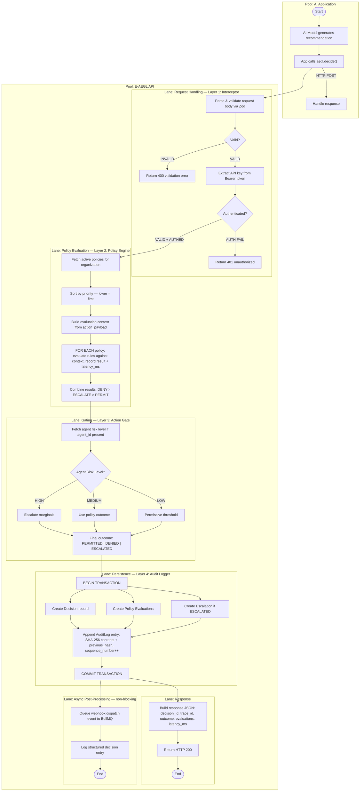

# BP-001: Decision Pipeline

**Process ID:** BP-001
**Type:** Real-time, synchronous
**SLA:** &lt; 10ms end-to-end
**Trigger:** SDK calls `POST /v1/decisions`
**Owner:** API Server
**Source:** `apps/api/src/routes/decisions.ts`

## BPMN Diagram



## Process Steps

| Step | Component | Action | Latency Budget | Fail Behavior |
|------|-----------|--------|---------------|---------------|
| 1 | Express middleware | Parse JSON body, validate with Zod schema | &lt; 0.5ms | 400 Bad Request |
| 2 | Auth middleware | Extract Bearer token, SHA-256 hash, DB lookup | &lt; 1ms | 401 Unauthorized |
| 3 | RBAC middleware | Check `decisions:write` permission | &lt; 0.5ms | 403 Forbidden |
| 4 | Route handler | Fetch active policies for organization | &lt; 1ms | 500 + fail-closed |
| 5 | Policy engine | Evaluate all rules against action_payload | &lt; 5ms | DENIED (fail-closed) |
| 6 | Action gate | Combine policy outcome + agent risk level | &lt; 0.5ms | DENIED (fail-closed) |
| 7 | Prisma transaction | Atomically write Decision + Evaluations + Escalation + AuditLog | &lt; 3ms | Transaction rollback |
| 8 | Response | Return JSON with outcome, evaluations, latency_ms | &lt; 0.5ms | — |
| 9 | Async | Queue webhook + structured log | Non-blocking | Retry via BullMQ |

## Inputs

| Field | Type | Required | Description |
|-------|------|----------|-------------|
| `actionType` | string | Yes | What the AI wants to do (e.g., `approve_loan`) |
| `actionPayload` | object | Yes | Parameters of the action (e.g., `{ amount: 250000 }`) |
| `context` | object | No | Additional context (user info, session, etc.) |
| `agentId` | string | No | ID of the AI agent making the request |
| `modelId` | string | No | ID of the AI model used |
| `userId` | string | No | End user associated with the action |

## Outputs

| Field | Type | Description |
|-------|------|-------------|
| `decision_id` | string | Unique decision identifier |
| `trace_id` | string | Trace ID for audit trail correlation |
| `outcome` | enum | `PERMITTED`, `DENIED`, or `ESCALATED` |
| `outcome_reason` | string | Human-readable explanation |
| `evaluations` | array | Per-policy evaluation results |
| `latency_ms` | number | Total processing time |
| `escalation_id` | string? | If escalated, the escalation ID |
| `sla_deadline` | string? | If escalated, the SLA deadline (24h from now) |

## Error Handling

| Error | HTTP Code | Behavior | Recovery |
|-------|-----------|----------|----------|
| Invalid request body | 400 | Return validation errors | Fix request |
| Missing/invalid API key | 401 | Reject immediately | Check credentials |
| Insufficient permissions | 403 | Reject immediately | Request access |
| Policy engine exception | 500 | DENIED (fail-closed) | Investigate logs |
| Database write failure | 500 | Transaction rollback, DENIED | Check DB health |
| Timeout (&gt; 30s) | 504 | Request canceled, DENIED | Investigate load |

## Policy Evaluation Logic

```
for each policy in activePolices (sorted by priority):
    for each rule in policy.rules:
        evaluate rule.field against rule.operator and rule.value
        using context[rule.field] from flattened action_payload + context

    if ANY rule evaluates to DENY  → policy result = DENY
    if ANY rule evaluates to ESCALATE → policy result = ESCALATE
    if ALL rules evaluate to PASS  → policy result = PERMIT
    if NO rules match              → policy result = SKIP

final outcome = first non-SKIP result in priority order
    DENY takes precedence over ESCALATE
    ESCALATE takes precedence over PERMIT
    if all SKIP → PERMITTED (no applicable policy)
```

## Latency Budget Allocation

```
Total budget: 10ms
├── Request parsing + validation:  0.5ms  (5%)
├── Authentication:                1.0ms  (10%)
├── Policy fetch:                  1.0ms  (10%)
├── Policy evaluation:             3.0ms  (30%) ← deterministic, no ML
├── Action gate:                   0.5ms  (5%)
├── Database transaction:          3.0ms  (30%)
├── Response serialization:        0.5ms  (5%)
└── Buffer:                        0.5ms  (5%)
```
