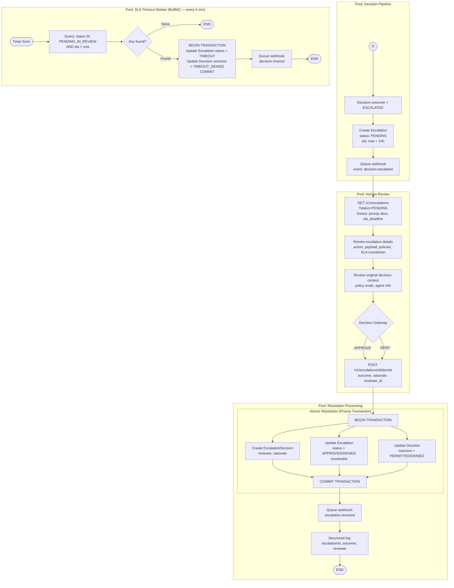
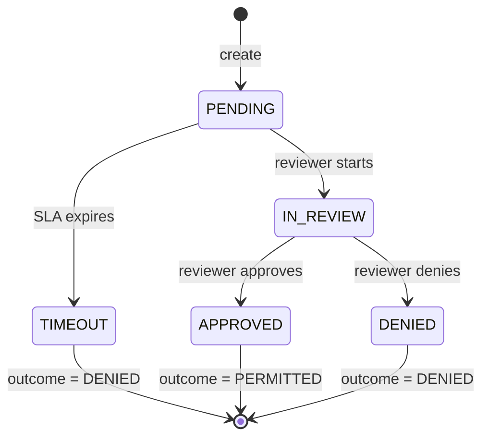

# BP-002: Escalation Lifecycle

**Process ID:** BP-002
**Type:** Asynchronous with human-in-the-loop
**SLA:** 24 hours from creation to resolution
**Trigger:** Decision outcome = ESCALATED
**Owner:** Escalation subsystem (API + BullMQ workers)
**Source:** `apps/api/src/routes/escalations.ts`, `apps/api/src/workers/escalation-sla.ts`

## BPMN Diagram

## State Machine

## Process Steps

### Phase A: Escalation Creation (Automatic)
| Step | Actor | Action | Source |
|------|-------|--------|--------|
| A1 | Decision Pipeline | Decision outcome evaluated as ESCALATED | `routes/decisions.ts` |
| A2 | Prisma Transaction | Create Escalation record (status=PENDING, sla=now+24h) | `routes/decisions.ts` |
| A3 | Webhook Dispatcher | Queue `decision.escalated` event | `workers/webhook-dispatcher.ts` |

### Phase B: Human Review (Manual)
| Step | Actor | Action | Source |
|------|-------|--------|--------|
| B1 | Reviewer | List pending escalations (sorted by priority + SLA) | `routes/escalations.ts` |
| B2 | Reviewer | Inspect escalation detail (original decision, policies, context) | `routes/escalations.ts` |
| B3 | Reviewer | Submit decision (APPROVED/DENIED + written rationale) | `routes/escalations.ts` |

### Phase C: Resolution (Automatic)
| Step | Actor | Action | Source |
|------|-------|--------|--------|
| C1 | API | Validate reviewer exists in organization | `routes/escalations.ts` |
| C2 | API | Verify escalation is PENDING or IN_REVIEW (not already resolved) | `routes/escalations.ts` |
| C3 | Prisma Transaction | Create EscalationDecision + Update Escalation status + Update Decision outcome | `routes/escalations.ts` |
| C4 | Webhook Dispatcher | Queue `escalation.resolved` event | `workers/webhook-dispatcher.ts` |

### Phase D: SLA Timeout (Automatic — Fail-Closed)
| Step | Actor | Action | Source |
|------|-------|--------|--------|
| D1 | BullMQ Worker | Run every 5 minutes | `workers/escalation-sla.ts` |
| D2 | Worker | Query escalations where status IN (PENDING, IN_REVIEW) AND slaDeadline &lt; now | `workers/escalation-sla.ts` |
| D3 | Prisma Transaction | Set escalation status=TIMEOUT, decision outcome=TIMEOUT_DENIED | `workers/escalation-sla.ts` |
| D4 | Webhook Dispatcher | Queue `decision.timeout` event | `workers/escalation-sla.ts` |

## Business Rules

1. **SLA Duration**: 24 hours from escalation creation (configurable)
2. **Fail-Closed**: If SLA expires without review, decision is DENIED
3. **Single Resolution**: An escalation can only be resolved once (409 if already resolved)
4. **Reviewer Validation**: Reviewer must belong to same organization as escalation
5. **Rationale Required**: Written rationale is mandatory (1-5000 characters)
6. **Priority Ordering**: Escalations sorted by priority (desc) then SLA deadline (asc — oldest first)
7. **Webhook Events**: `decision.escalated`, `escalation.resolved`, `decision.timeout`
