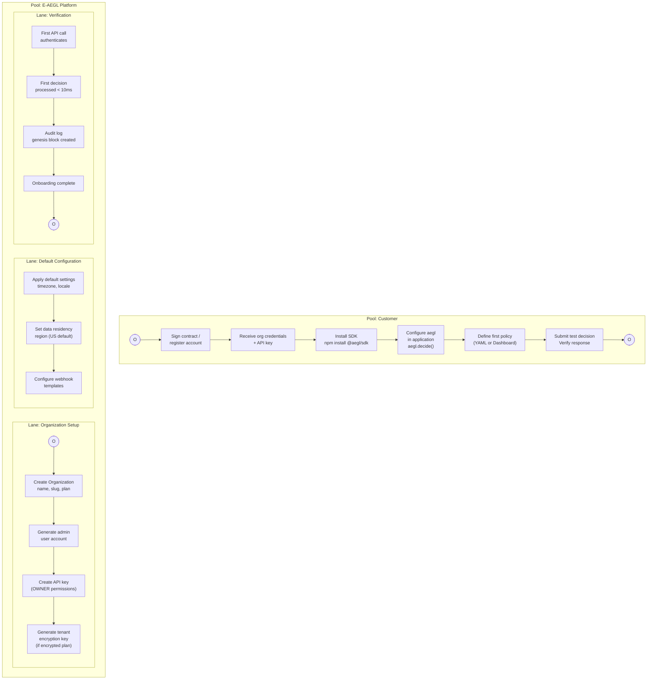

# BP-009: Tenant Onboarding

**Process ID:** BP-009
**Type:** Manual + automated
**SLA:** &lt; 1 business day
**Trigger:** New customer signs up or contract signed
**Owner:** Platform team + customer

## BPMN Diagram

## Onboarding Checklist

| Step | Actor | Action | Verification |
|------|-------|--------|-------------|
| 1 | Platform | Create Organization record | org.id exists in DB |
| 2 | Platform | Create admin User account | user can login to dashboard |
| 3 | Platform | Generate OWNER API key | Key authenticates successfully |
| 4 | Platform | Generate tenant encryption key | Key stored securely |
| 5 | Customer | Install SDK in application | `import { AEGL } from '@aegl/sdk'` compiles |
| 6 | Customer | Configure API key | `AEGL_API_KEY` env var set |
| 7 | Customer | Write first policy | Policy visible in dashboard |
| 8 | Customer | Submit test decision | Response includes outcome + trace_id |
| 9 | Customer | Verify audit log | Dashboard shows first audit entry |
| 10 | Customer | Configure webhooks (optional) | Webhook receives test event |

## Self-Hosted Onboarding

For self-hosted deployments, additional steps:

| Step | Actor | Action |
|------|-------|--------|
| 1 | Customer DevOps | `docker compose -f docker-compose.selfhosted.yml up` |
| 2 | Customer DevOps | Run Prisma migrations: `npx prisma migrate deploy` |
| 3 | Customer DevOps | Seed initial organization: `npm run seed` |
| 4 | Customer DevOps | Configure `.env` with secrets |
| 5 | Customer DevOps | Verify health: `curl http://localhost:4000/health/ready` |
| 6 | Customer | Connect SDK to self-hosted API URL |
