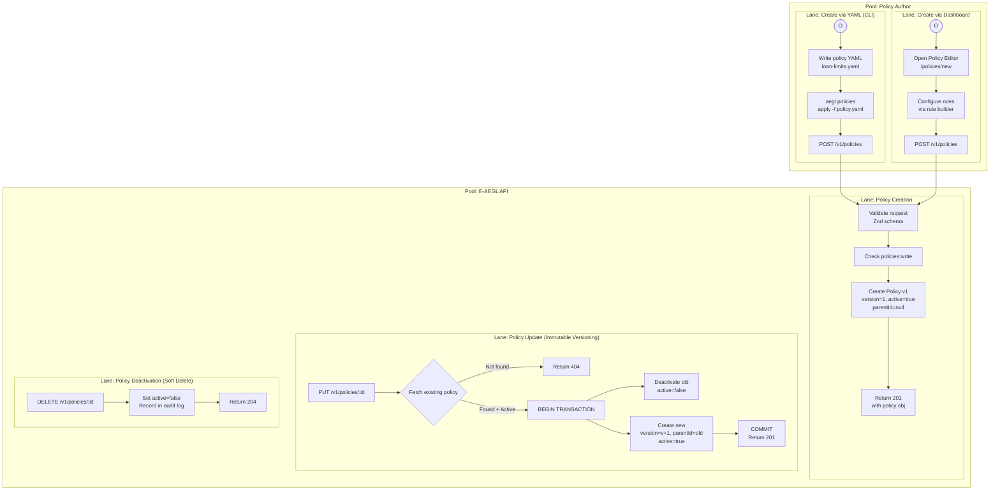
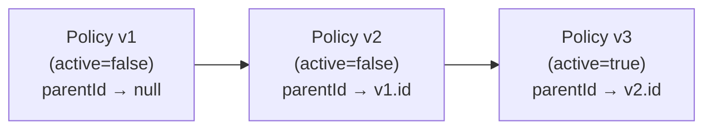

# BP-003: Policy Lifecycle

**Process ID:** BP-003
**Type:** CRUD with immutable versioning
**Trigger:** API call or CLI `aegl policies apply`
**Owner:** Policy management subsystem
**Source:** `apps/api/src/routes/policies.ts`

## BPMN Diagram



## Version Chain

Policies are **never mutated**. Each update creates a new version linked to the previous:



**Why immutable versioning?**
- Every historical decision records the exact `policyId` + `version` that governed it
- Audit reconstruction: "What policy was in effect when this loan was approved on March 1?"
- Regulators can verify that policy changes are tracked and reversible
- No retroactive policy tampering — old versions are preserved in the database

## Policy YAML Schema

```yaml
# policies/loan-limits.yaml
name: "Loan Approval Limits"
description: "Enforce maximum loan amounts by tier"
type: THRESHOLD          # STATIC | DYNAMIC | THRESHOLD
priority: 10             # Lower = higher priority (0-10000)
scope:
  action_types:
    - approve_loan
    - modify_loan
rules:
  - field: "amount"
    operator: "gt"
    value: 500000
    action: DENY
    reason: "Loan amount exceeds $500K maximum"
  - field: "amount"
    operator: "gt"
    value: 200000
    action: ESCALATE
    reason: "Loan >$200K requires senior reviewer approval"
```

## Rule Operators

| Operator | Description | Example |
|----------|-------------|---------|
| `eq` | Equal to | `field: "status", operator: "eq", value: "blocked"` |
| `neq` | Not equal to | `field: "country", operator: "neq", value: "US"` |
| `gt` | Greater than | `field: "amount", operator: "gt", value: 100000` |
| `gte` | Greater than or equal | `field: "score", operator: "gte", value: 0.8` |
| `lt` | Less than | `field: "age", operator: "lt", value: 18` |
| `lte` | Less than or equal | `field: "risk", operator: "lte", value: 3` |
| `in` | Value in list | `field: "type", operator: "in", value: ["A", "B"]` |
| `not_in` | Value not in list | `field: "tier", operator: "not_in", value: ["blocked"]` |
| `contains` | String contains | `field: "reason", operator: "contains", value: "override"` |
| `matches` | Regex match | `field: "email", operator: "matches", value: ".*@bank\\.com"` |

## Business Rules

1. **Priority ordering**: Lower number = higher priority. Policy with priority 10 evaluates before priority 100.
2. **Scope filtering**: If a policy has `scope.action_types`, it only evaluates for matching action types.
3. **Immediate activation**: New policies are active immediately upon creation.
4. **Atomic version swap**: Old version deactivated and new version created in single transaction.
5. **Soft delete only**: Deactivation sets `active=false`. Records are never physically deleted.
6. **Version traceability**: `parentId` links to the previous version, creating an audit-friendly linked list.
