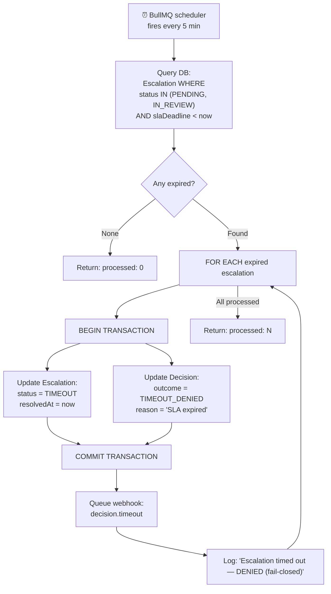

# BP-008: SLA Timeout Enforcement

**Process ID:** BP-008
**Type:** Scheduled worker (BullMQ repeatable job)
**Frequency:** Every 5 minutes
**SLA:** Expired escalations processed within 10 minutes of deadline
**Owner:** SLA timeout worker
**Source:** `apps/api/src/workers/escalation-sla.ts`

## BPMN Diagram

## Configuration

| Parameter | Default | Env Var | Description |
|-----------|---------|---------|-------------|
| Check interval | 5 minutes | `SLA_CHECK_INTERVAL_MS` | How often the worker runs |
| SLA duration | 24 hours | Set at escalation creation | Deadline per escalation |
| Job retention (completed) | 100 | — | BullMQ completed job history |
| Job retention (failed) | 50 | — | BullMQ failed job history |

## Fail-Closed Guarantee

The SLA timeout enforces the **fail-closed** principle:

1. If no human reviews an escalation within 24 hours → action is **DENIED**
2. The original decision record is updated to `TIMEOUT_DENIED`
3. This ensures that the absence of human action is treated as denial
4. Organizations can configure different SLA durations per policy (future feature)

## Edge Cases

| Scenario | Behavior |
|----------|----------|
| Worker crashes mid-processing | BullMQ retries the job on next cycle |
| Database transaction fails | Escalation remains PENDING; processed on next cycle |
| Multiple workers running | Each escalation processed exactly once (transactional) |
| Clock skew between workers | Uses database server time, not worker time |
| Escalation resolved between query and update | Transaction serialization prevents double-processing |
