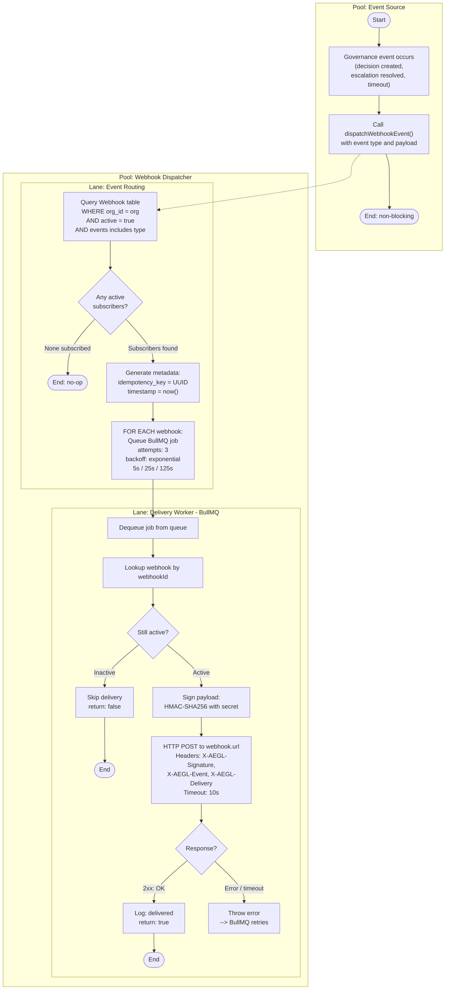

# BP-007: Webhook Dispatch

**Process ID:** BP-007
**Type:** Asynchronous queue-based delivery
**SLA:** Best-effort with 3 retries (5s, 25s, 125s backoff)
**Trigger:** Governance events (decisions, escalations, timeouts)
**Owner:** Webhook dispatcher worker
**Source:** `apps/api/src/workers/webhook-dispatcher.ts`

## BPMN Diagram



## Event Types

| Event | Trigger | Payload Fields |
|-------|---------|---------------|
| `decision.permitted` | Decision outcome = PERMITTED | decision_id, trace_id, action_type, agent_id |
| `decision.denied` | Decision outcome = DENIED | decision_id, trace_id, action_type, reason |
| `decision.escalated` | Decision outcome = ESCALATED | decision_id, trace_id, action_type, escalation_id, sla_deadline |
| `decision.timeout` | SLA worker times out escalation | decision_id, trace_id, escalation_id, sla_deadline |
| `escalation.resolved` | Reviewer submits decision | escalation_id, decision_id, reviewer_id, outcome, rationale |
| `policy.created` | New policy created | policy_id, name, version |
| `policy.updated` | Policy version updated | policy_id, name, old_version, new_version |
| `policy.deactivated` | Policy deactivated | policy_id, name |

## Payload Structure

```json
{
  "organizationId": "org_abc123",
  "event": "decision.denied",
  "data": {
    "decision_id": "dec_xyz789",
    "trace_id": "tr_abc123def456",
    "action_type": "approve_loan",
    "outcome": "DENIED",
    "outcome_reason": "Loan amount exceeds $500K maximum",
    "agent_id": "agent_loan_bot",
    "latency_ms": 4
  },
  "timestamp": "2026-03-01T12:00:00.000Z",
  "idempotency_key": "550e8400-e29b-41d4-a716-446655440000"
}
```

## Webhook Signature Verification (Client-Side)

```python
import hmac, hashlib

def verify_webhook(body: bytes, signature: str, secret: str) -> bool:
    expected = hmac.new(
        secret.encode(), body, hashlib.sha256
    ).hexdigest()
    return hmac.compare_digest(f"sha256={expected}", signature)

# Usage:
signature = request.headers["X-AEGL-Signature"]
is_valid = verify_webhook(request.body, signature, WEBHOOK_SECRET)
```

## Retry Strategy

| Attempt | Delay | Cumulative Wait |
|---------|-------|----------------|
| 1 (initial) | 0s | 0s |
| 2 (retry 1) | 5s | 5s |
| 3 (retry 2) | 25s | 30s |
| 4 (retry 3) | 125s | ~2.5 min |
| **Failed** | — | Permanently failed, logged |
