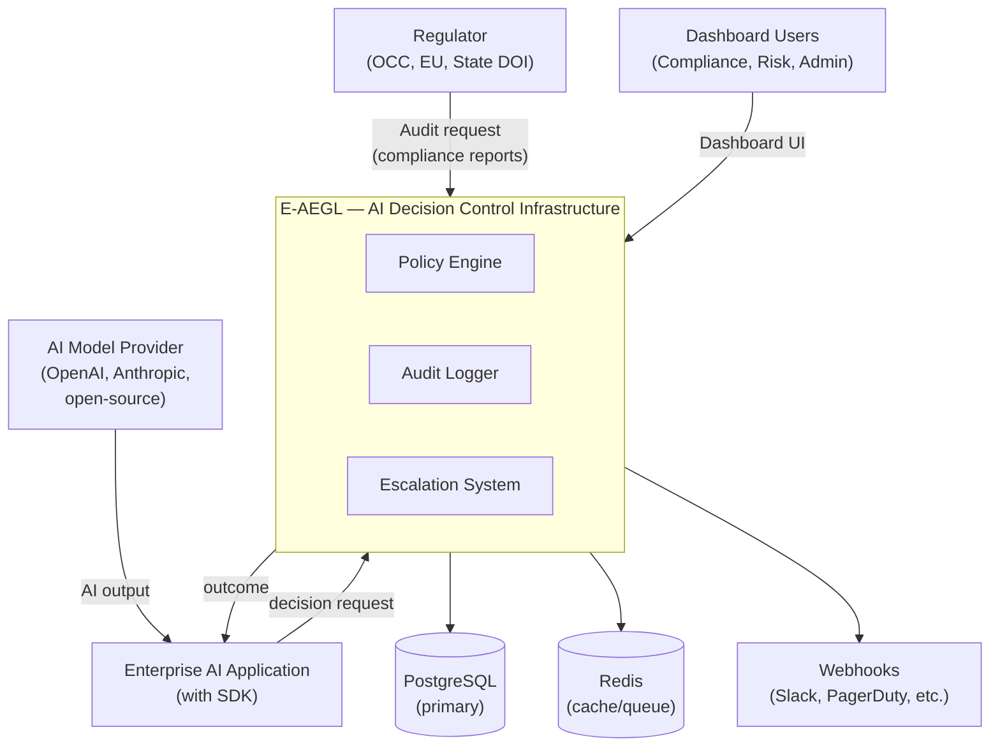
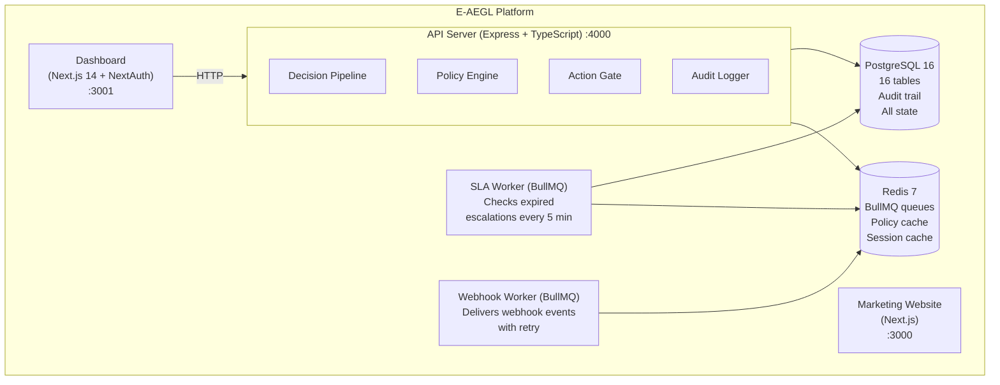
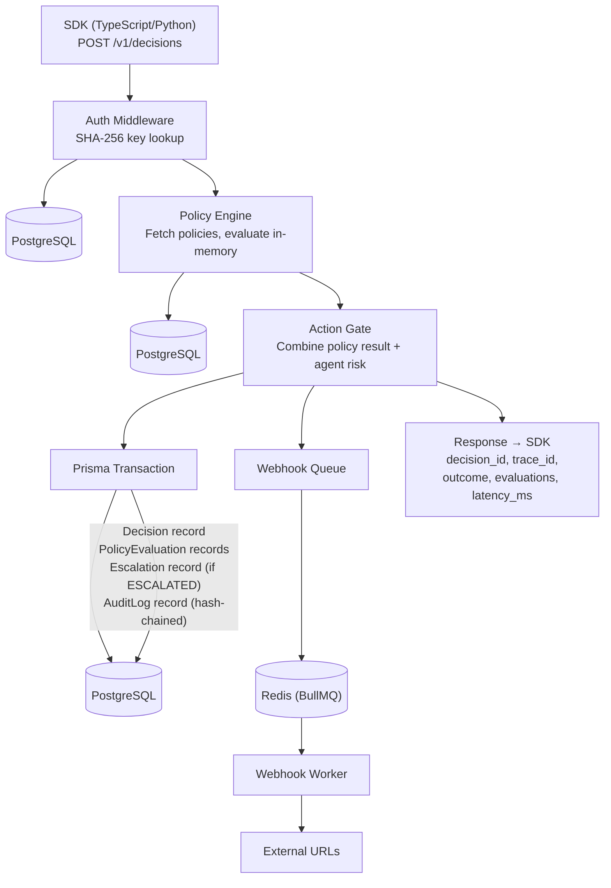

# System Context Diagram

## C4 Level 1: System Context

## C4 Level 2: Container Diagram

## Data Flow: Decision Request

## Technology Boundaries

| Boundary | Protocol | Authentication | Latency |
|----------|----------|---------------|---------|
| SDK → API | HTTPS / gRPC | Bearer API key | ~1ms (local), ~10ms (remote) |
| API → PostgreSQL | TCP (libpq) | Connection string credentials | ~1ms |
| API → Redis | TCP (RESP) | Connection string (optional auth) | ~0.5ms |
| Dashboard → API | HTTPS | Session cookie (NextAuth) | ~10ms |
| Webhook Worker → External | HTTPS | HMAC-SHA256 signature | Variable |
| CLI → API | HTTPS | Bearer API key | ~10ms |
