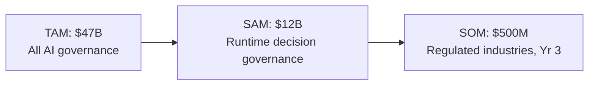

# Enterprise Mandate

## Why Now: The Regulatory Forcing Function

AI governance is no longer optional. Multiple regulatory frameworks now mandate runtime governance of AI decision-making in regulated industries.

### Active Regulations

| Regulation | Jurisdiction | Effective | Requirement | E-AEGL Coverage |
|-----------|-------------|-----------|-------------|-----------------|
| **EU AI Act** | European Union | August 2025 | Risk-based AI governance, human oversight for high-risk systems, audit trails | Policy engine, escalation system, audit trail |
| **OCC SR 11-7** | US Banking | Active | Model risk management for all models used in decision-making | Decision governance, policy versioning, compliance reports |
| **FDIC FIL-22-2017** | US Banking | Active | Third-party risk management for AI vendors | Multi-tenancy isolation, SOC 2 evidence |
| **NIST AI RMF** | US Federal | Active | AI risk management framework (Govern, Map, Measure, Manage) | Full lifecycle governance |
| **Executive Order 14110** | US Federal | Active | Safe, secure, and trustworthy AI development | Fail-closed enforcement, audit trails |
| **NYC Local Law 144** | NYC | Active | Automated employment decision tools bias audit | Decision logging, compliance export |
| **Colorado SB 21-169** | Colorado | Active | Insurance AI governance and transparency | Policy enforcement, audit export |

### Upcoming Regulations

| Regulation | Jurisdiction | Expected | Impact |
|-----------|-------------|----------|--------|
| **NAIC Model Bulletin** | US Insurance (all states) | 2025-2026 | Mandates AI governance for insurance decisions |
| **FDA AI/ML SaMD** | US Healthcare | 2025-2026 | Software as a Medical Device AI governance |
| **Basel III.1 AI Annex** | Global Banking | 2026 | AI model governance for capital calculations |
| **UK AI Safety Bill** | United Kingdom | 2026 | AI safety reporting and governance requirements |

## The Economic Case

### Market Size

### Unit Economics

| Metric | Target |
|--------|--------|
| Average Contract Value (ACV) | $120K/year |
| Gross Margin | 75-85% |
| Cost per Decision | $0.001 (overage pricing) |
| Customer Payback Period | < 12 months |
| Logo Retention | > 95% |
| Net Dollar Retention | > 130% |

### Why 75%+ Gross Margins

E-AEGL operates at the **decision boundary**, not the **token stream**. Comparison:

| Approach | Evaluations per AI Task | Infrastructure Cost |
|----------|------------------------|-------------------|
| Token-level inspection | 10,000-100,000 tokens per task | $0.10-$1.00 per task |
| Prompt analysis | 1 per task (input) | $0.01-$0.10 per task |
| **Decision boundary (E-AEGL)** | **1 per action** | **$0.001 per action** |

An enterprise AI agent making 1,000 decisions/day costs E-AEGL ~$1/day to govern. The same agent under token-level inspection costs $100-$1,000/day.

## Organizational Structure

### Functional Roles

| Role | Responsibility | E-AEGL Feature |
|------|---------------|----------------|
| **Chief Risk Officer (CRO)** | AI risk oversight, regulatory reporting | Compliance summary, SOC 2 evidence |
| **Model Risk Management (MRM)** | Model validation, ongoing monitoring | Policy engine, decision analytics |
| **AI/ML Engineering** | Model deployment, integration | SDK integration, policy-as-code |
| **Compliance** | Regulatory reporting, audit preparation | Audit export, compliance reports |
| **Security** | Access control, data protection | RBAC, tenant isolation, encryption |
| **Operations** | Platform reliability, incident response | Monitoring, alerting, DR runbooks |
| **Product** | Feature requirements, user feedback | Dashboard, analytics |

### RACI Matrix

| Activity | CRO | MRM | Engineering | Compliance | Security | Ops |
|----------|-----|-----|------------|------------|----------|-----|
| Define governance policies | A | R | C | C | I | I |
| Implement SDK integration | I | C | R | I | C | A |
| Review escalated decisions | I | R | I | C | I | I |
| Export compliance reports | A | C | I | R | I | I |
| Manage API keys and access | I | I | C | I | R | A |
| Monitor system health | I | I | C | I | I | R |
| Respond to audit requests | A | C | I | R | C | I |
| Perform disaster recovery | I | I | C | I | C | R |

*R = Responsible, A = Accountable, C = Consulted, I = Informed*

## Compliance Certifications Roadmap

| Certification | Target Date | Status | Description |
|--------------|------------|--------|-------------|
| SOC 2 Type I | Q2 2026 | In progress | Point-in-time controls assessment |
| SOC 2 Type II | Q4 2026 | Planned | Continuous controls assessment (6-month window) |
| ISO 27001 | Q2 2027 | Planned | Information security management system |
| FedRAMP Moderate | Q4 2027 | Planned | US federal cloud authorization |
| HIPAA BAA | Q1 2027 | Planned | Healthcare data protection |

## Risk Register

| Risk | Likelihood | Impact | Mitigation |
|------|-----------|--------|------------|
| Regulatory timeline accelerates | High | High | Architecture designed for rapid compliance adaptation |
| Competitor launches runtime governance | Medium | High | Speed to market; SDK-first architecture is defensible |
| Enterprise sales cycle > 9 months | High | Medium | Self-hosted option reduces procurement friction |
| Hash chain compromise | Low | Critical | Cryptographic verification; offline backup verification |
| SDK performance regression | Medium | High | Automated benchmark testing in CI/CD |
| Multi-tenant data leak | Low | Critical | Row-level security; per-tenant encryption; E2E testing |
