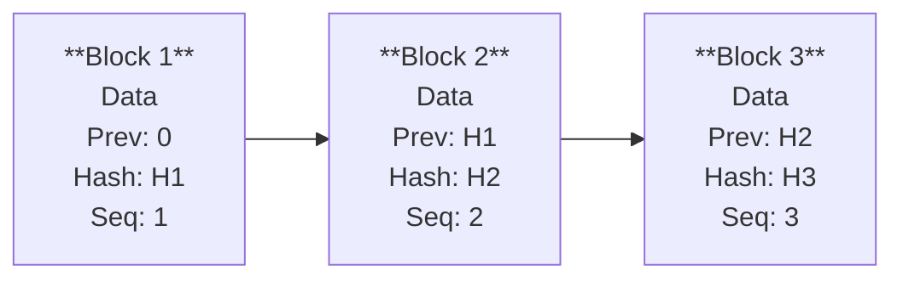

# Audit Logs

Every AI decision processed by E-AEGL is recorded in an **append-only, SHA-256 hash-chained** audit log. This creates a tamper-evident trail that is legally defensible in regulatory proceedings.

## How Hash Chains Work

Each audit log entry contains:
1. **Record data** — Full decision details (action type, payload, outcome, evaluations)
2. **Previous hash** — SHA-256 hash of the preceding record
3. **Current hash** — SHA-256 hash of (record data + previous hash + sequence number)
4. **Sequence number** — Monotonically increasing, per-organization

If any record in the chain is modified, its hash changes, which breaks the chain from that point forward. This makes tampering detectable.



## Querying Audit Logs

### Via Dashboard

1. Navigate to **Audit Logs** in the sidebar
2. Use filters:
   - **Search**: Filter by action type
   - **Outcome**: PERMITTED, DENIED, ESCALATED
   - **Date range**: Custom time window
3. Click a trace ID to view the full decision trace

### Via API

```bash
# List audit logs with filters
curl -H "Authorization: Bearer $AEGL_API_KEY" \
  "https://api.aegl.io/v1/audit?outcome=DENIED&from=2026-01-01&to=2026-02-28&limit=50"

# Get full trace by trace ID
curl -H "Authorization: Bearer $AEGL_API_KEY" \
  "https://api.aegl.io/v1/audit/trace_abc123"
```

### Via CLI

```bash
aegl audit query --from 2026-01-01 --outcome DENIED
```

## Verifying Chain Integrity

Verify that the audit chain has not been tampered with:

### Via Dashboard

Click the **Verify Chain Integrity** button on the Audit Logs page. The system checks every block in the chain and reports:
- Total blocks verified
- Integrity status (valid/broken)
- Location of any break (if found)

### Via API

```bash
curl -H "Authorization: Bearer $AEGL_API_KEY" \
  "https://api.aegl.io/v1/audit/integrity"
```

Response (valid):
```json
{
  "valid": true,
  "total_blocks": 15847,
  "checked_at": "2026-03-01T12:00:00Z"
}
```

Response (tampered):
```json
{
  "valid": false,
  "total_blocks": 15847,
  "broken_at": 12453,
  "checked_at": "2026-03-01T12:00:00Z"
}
```

## Decision Trace

Each decision has a complete trace accessible via its trace ID:

```json
{
  "trace_id": "trace_abc123",
  "decision": {
    "id": "dec_abc123",
    "action_type": "approve_loan",
    "action_payload": { "amount": 350000 },
    "outcome": "ESCALATED",
    "latency_ms": 4,
    "received_at": "2026-03-01T10:00:00Z"
  },
  "policy_evaluations": [
    {
      "policy": "Credit Score Floor",
      "result": "PASS",
      "details": "credit_score 720 >= 580"
    },
    {
      "policy": "Loan Amount Limits",
      "result": "ESCALATE",
      "details": "amount 350000 > 200000"
    }
  ],
  "escalation": {
    "id": "esc_xyz789",
    "status": "PENDING",
    "sla_deadline": "2026-03-01T14:00:00Z"
  }
}
```

## SOC 2 Evidence

For compliance audits, export SOC 2 evidence reports:

```bash
curl -H "Authorization: Bearer $AEGL_API_KEY" \
  "https://api.aegl.io/v1/compliance/soc2-evidence?period=2026-Q1"
```

This generates evidence across four Trust Service Criteria:
- **Access Control**: API key usage, authentication events
- **Change Management**: Policy versions, configuration changes
- **Monitoring**: Decision volume, latency SLA compliance
- **Data Protection**: Hash chain integrity, encryption status

## Decision Replay

Re-evaluate a historical decision against current policies:

```bash
curl -X POST -H "Authorization: Bearer $AEGL_API_KEY" \
  "https://api.aegl.io/v1/decisions/dec_abc123/replay"
```

This shows what outcome the decision would receive under current policies, without modifying the original audit record.
