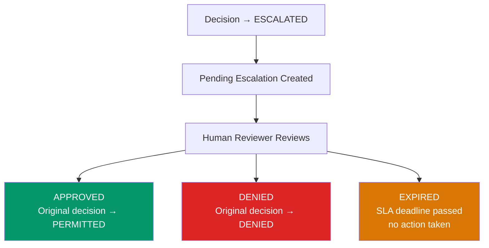

# Escalation Workflow

When a decision is **ESCALATED**, it requires human review before the action can proceed. This is the human-in-the-loop control mechanism for high-risk decisions.

## How Escalations Are Created

Escalations are triggered by:

1. **THRESHOLD policies** — When a policy of type THRESHOLD fires, the decision is escalated instead of denied
2. **HIGH/CRITICAL risk agents** — Agents with elevated risk levels can trigger automatic escalation via the Action Gate
3. **ESCALATE rule actions** — Individual rules within any policy type can specify `action: ESCALATE`

## Escalation Lifecycle



## SLA Deadlines

Each escalation has an SLA deadline — the time by which a human must respond. If the deadline passes without action, the escalation is marked as EXPIRED.

Default SLA windows by priority:
- **CRITICAL**: 1 hour
- **HIGH**: 4 hours
- **MEDIUM**: 24 hours
- **LOW**: 72 hours

## Reviewing Escalations

### Via Dashboard

1. Navigate to **Escalations** in the sidebar
2. Filter by status (PENDING, APPROVED, DENIED, EXPIRED)
3. Click an escalation to view:
   - Original decision details
   - Action payload
   - Policy that triggered the escalation
   - Escalation reason
   - SLA countdown timer
4. Select **Approve** or **Deny**
5. Enter a rationale (required)
6. Submit the decision

### Via API

```bash
curl -X POST https://api.aegl.io/v1/escalations/esc_xyz789/decide \
  -H "Authorization: Bearer $AEGL_API_KEY" \
  -H "Content-Type: application/json" \
  -d '{
    "decision": "APPROVED",
    "rationale": "Verified borrower income documentation supports this loan amount"
  }'
```

Response:
```json
{
  "id": "esc_xyz789",
  "status": "APPROVED",
  "resolved_by": "user_reviewer1",
  "resolved_at": "2026-03-01T14:30:00Z",
  "rationale": "Verified borrower income documentation supports this loan amount",
  "original_decision": {
    "id": "dec_abc123",
    "outcome": "PERMITTED"
  }
}
```

## Webhook Notifications

Configure webhooks to receive real-time notifications when escalations are created or resolved:

```json
{
  "events": ["escalation.created", "escalation.resolved"]
}
```

This enables integration with Slack, PagerDuty, email, or any HTTP endpoint.

## Audit Trail

Every escalation action is recorded in the audit trail:
- The original escalation creation
- The reviewer's decision (with rationale)
- The update to the original decision's outcome

All entries are hash-chain verified for tamper evidence.
